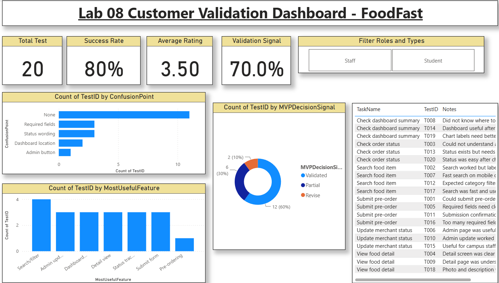

Markdown

# Analytics & Insights Report — FoodFast

This report highlights our critical validation metrics, maps feedback to our functional requirements (FR), and visually presents our Power BI results[cite: 5].

## 1. Core Validation Metrics
* **Task Success Rate:** 80% (16 out of 20 tasks successfully completed)[cite: 5].
* **Average Feedback Score:** 4.05 / 5.00 (High subjective usability)[cite: 5].
* **Average Interest Level:** 4.15 / 5.00 (Strong validation of user value)[cite: 5].
* **Total Tests Count:** 20[cite: 5].

## 2. Power BI Customer Validation Dashboard
Our active dashboard visualizes the success rate, satisfaction distribution, and key user problem areas:

## 3. Common Confusion Points & Affected Requirements
Using our metrics, we tracked exact failure points back to our functional requirements[cite: 5]:

* **Status Wording (FR-05):** Caused confusion in 3 tests. Users found transition labels (e.g., "Pending" to "Preparing") unclear[cite: 5].
* **Required Fields (FR-03):** Accounts for 3 confusion points. Forms during checkout felt cluttered with too many mandatory inputs[cite: 5].
* **Dashboard Location (FR-04):** Led to 2 confusion points. Users had trouble locating the central
